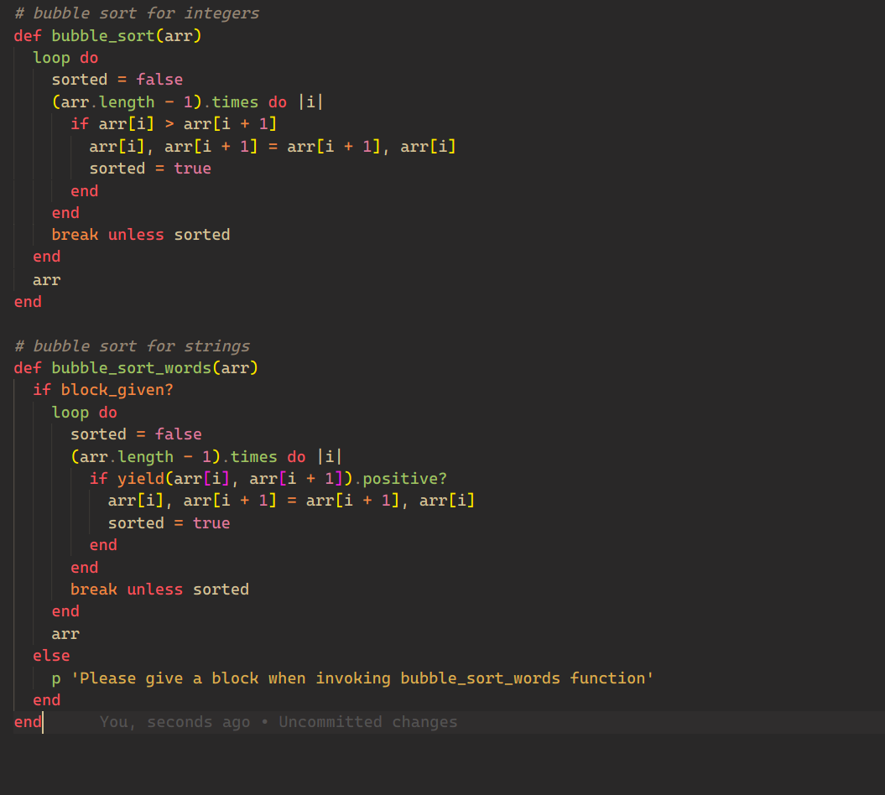

# Bubble Sort

> Bubble Sort solution for both strings and integers using Ruby language.

>Bubble sort, sometimes referred to as sinking sort, is a simple sorting algorithm that repeatedly steps through the list, compares adjacent elements and swaps them if they are in the wrong order. The pass through the list is repeated until the list is sorted. The algorithm, which is a comparison sort, 
is named for the way smaller or larger elements "bubble" to the top of the list.
[Read me on Wikipedia](https://en.wikipedia.org/wiki/Bubble_sort) 

## Built With

- Ruby Programming Language

## Getting Started

To get a local copy up and running follow these simple example steps.

-1. Go to "https://github.com/SamroodAli/bubble-sort"__
-2. Click on the green button with text "code" and copy the  HTTPS/SSH URL__
-3. If you cannot understand the instruction above, cppy this:  git@github.com:SamroodAli/bubble-sort.git__
-4. In your computer, open your terminal application, type in git clone followed by the link you copied__
-git clone git@github.com:SamroodAli/bubble-sort.git__
-5. Run git checkout -b your-branch-name. Make your contributions__
-6. Push your branch up to your forked repository: git push -u origgin your-branch-name__
-7. Open a Pull Request with a detailed description of the development branch of the original project for a review__
## Run tests

Run robocop.yml ." to check linter errors

## Authors

👤 **Samrood Ali**
- GitHub: [@githubhandle](https://github.com/SamroodAli)
- LinkedIn: [LinkedIn](https://www.linkedin.com/in/samrood-ali/)

👤 **Stephanie Sakuhuni**

- GitHub: [@githubhandle](stephanie041996)
- LinkedIn: [LinkedIn](https://www.linkedin.com/in/stephanie-sakuhuni-a81029140/)

## 🤝 Contributing

- Odin project
- Microverse

Feel free to check the [issues page](issues/).

## Show your support

Give a ⭐️ if you like this project!

## 📝 License

This project is [MIT](lic.url) licensed.
